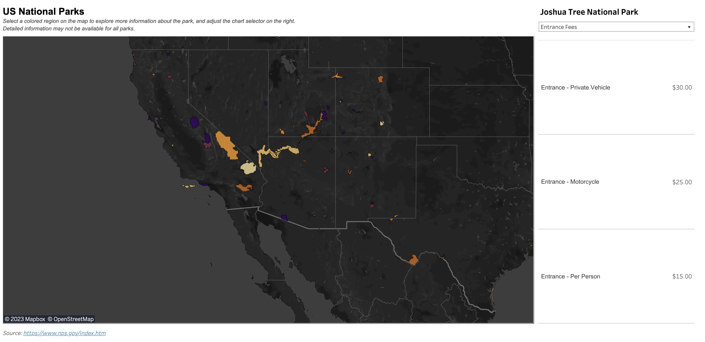

# National Parks Data Engineering Project

[Tableau Dashboard](https://public.tableau.com/app/profile/alexander.bates/viz/USNationalParksDashboard_16875553921500/NationalParksGeospatialDashboard?publish=yes)

*(Screenshot)*

I built a data engineering pipeline to visualize information about all 470 national parks in the United States. Data was extracted through the National Parks public API [here](https://www.nps.gov/subjects/developer/get-started.htm).

An AWS EC2 linux cluster served as the compute and host for Mage, an open-source data transformation and orchestration tool. Mage has exploded in popularity in recent years, serving as a modern alternative to Apache Airflow. One of the things I especially like about the tool is the ease of use when building DAGs and deploying CRON orchestration jobs. 

The json data extracted through the API was deeply nested at multiple levels. Therefore, I employed a number of techniques to parse, clean, and join the data. The end data is then exported to an S3 bucket, where it was staged and inserted into a Snowflake table.

Finally, I joined geospatial park data with my Snowflake data to enable a complete Tableau dashboard with the geographical boundaries of each park, along with the detailed information provided by the National Parks API.

See the architecture below:

